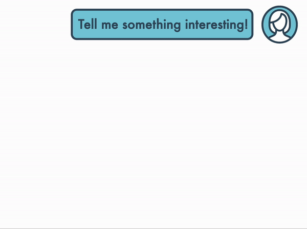

# [Dense Reward for Free in Reinforcement Learning from Human Feedback](https://openreview.net/forum?id=eyxVRMrZ4m)

### Alex J. Chan, Hao Sun, Samuel Holt, and Mihaela van der Schaar

### International Conference on Machine Learning (ICML) 2024

 [](https://opensource.org/licenses/MIT)
 <a href="https://github.com/psf/black"></a>

<div align="center">
    
</div>

Last Updated: 18 July 2024

Primary Code Author: Alex J. Chan (ajc340@cam.ac.uk)

This repo is pip installable - clone it, optionally create a virtual env, and install it:

```shell
git clone https://github.com/XanderJC/attention-based-credit.git

cd attention-based-credit

pip install -r requirements.txt

pip install -e .
```

The PPO implementation used is a small update to the [TRL](https://github.com/huggingface/trl) implementation, which it inherits from. Thus, please pay attention to the version used as TRL is very actively updated and breaking changes may have been introduced.

Scripts used to run the algorithms are in `experiments/scripts`, and each experiment in the paper has essentially its own corresponding script in `experiments/bash` which runs the necessary scripts to compile all the results, for example, to reproduce the experiment in Figure 3 you run:

```shell
bash experiments/bash/IMDb_base.sh
```
Note: You will need to update some paths in the bash scripts as well as the WandB entities for experiment tracking and result loading. The experiments were run on a machine with a single NVIDIA A6000 Ada card with 48GB VRAM, so any changes in setup may also require attention.

You can then generate the results and plots using:
```shell
python experiments/plotting/IMDb.py
```
Note: These can actually already be run without re-doing the experiments as I've saved cached results in `results/numerics` that the plotting scripts can access if `--use_wandb false`.

### Citing 

If you use this software please cite as follows:

```
@inproceedings{chan2024dense,
  title={Dense Reward for Free in Reinforcement Learning from Human Feedback},
  author={Alex James Chan and Hao Sun and Samuel Holt and Mihaela van der Schaar},
  booktitle={International Conference on Machine Learning}
  year={2024},
  url={https://openreview.net/forum?id=eyxVRMrZ4m}
}
```